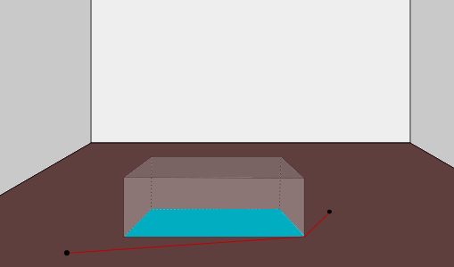
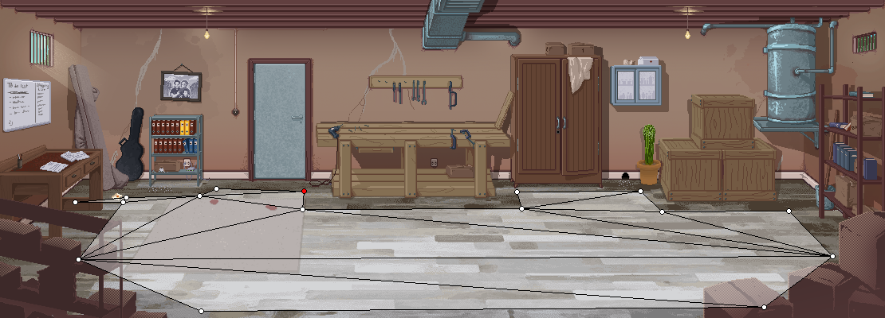
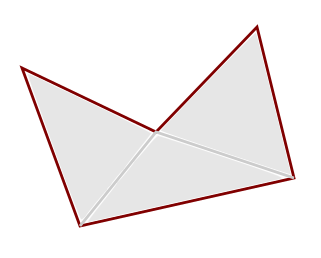
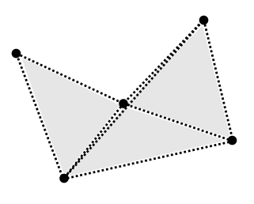
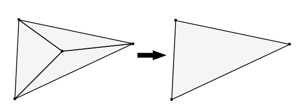
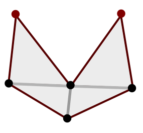
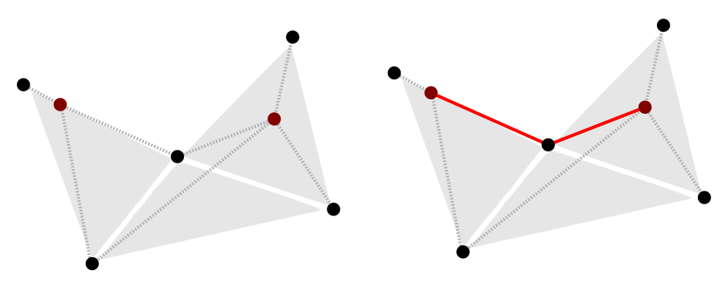
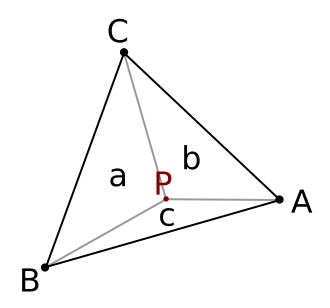

# StarFinder 

StarFinder implements A* based pathfinding on triangular navigation meshes in C#. It was written to be deployed in 2D graphic adventure games but can be used in other areas of application as well. A sandbox to play around with can be found in the [playground](https://github.com/advdotnet/STACK-Engine/tree/master/src/Playground/PathFinding).

## Pathfinding in 2D adventure games

In typical 2D adventure games, the player can move a character in a room by clicking with the mouse on a given position. The room is most likely drawn in a one point or two point perspective and there can be non walkable obstacles within the room which can obstruct the character when he is moving behind it.

In the sample room shown above, there is a table in the middle of the room which the player needed to walk around. The walkable area is shown in brown whereas the obstructed non walkable area is shown in blue. A sample path between two points is displayed as a red line, avoiding the blue area.

Besides doing pathfinding within the walkable areas of a room, we also should to be able to associate arbitrary data with any walkable point in the room like scaling of the character or, e.g., a color which would be used for shading.

## How it works

### Navigation mesh

StarFinder uses a triangular navigation mesh to define the walkable areas. A triangle is defined by three points ("vertices") and is always walkable. It can be reduced to a straight line if two vertices are identical. The triangles must not overlap with each other. A real life navigation mesh is depicted below:

Note that some distance to any obstacles is kept since the game character's sprite also has some width to consider. Otherwise it would look like the character was standing in the wall. 

This navigation mesh can be created programatically by giving a list of vertices and then defining which vertices belong to a triangle, or it can be created in a dedicated tool, saved to and later read from a file.

### Runtime processing

Upon initialisation on runtime, StarFinder once processes a given navigation mesh by
* storing a list of **obstructing edges** 
* calculating a **node collection**

The **obstructing edges** are the triangle edges that are not shared by two (or more) triangles, as drawn in dark red below:

The triangle edges drawn in light gray are not obstructing because they are shared by two adjacent triangles.

The **node collection** keeps track of any non redundant triangle vertex and also the information which node can be reached from which node without passing any obstructing edge ("link") using a line of sight check. Using the example above, the nodes would contain the following vertices and links between them:

Note that there is an additional link between the top right and the bottom left vertex because the line of sight is not obstructed by any of the obstructing edges.

Redundant nodes are triangle vertices whose number of triangles they are part of equals the number of edges they are part of. Consider the following sample where the vertex in the center is redundant as it is part of three triangles and three edges.

### Line of sight check

In order to find out which node is linked to which other node, a *line of sight* check with respect to the obstructing edges is performed. 

First, it is checked if the middle point between the given nodes is contained in the navigation mesh. If not, the result must be false. 

Else, all of the obstructing edges are iterated and it is checked if the nodes coincide with the vertices of the obstructing edge. If yes, the result is true. If not it is checked if the line segment of the obstructing edge crosses the line segment given by the two nodes, if yes, the result is false.

If there is no obstructing edge line segment crossing the line segment given by the nodes, the result is true.

We do the very first check to handle the situation in the following image: there clearly shouldn't be a link between the two nodes pictured in red. However, there isn't any obstructing edge (dark red) crossing the line of sight between them. But the middle point in between them isn't contained in the mesh.

### Pathfinding

Having both node collection (also containing the possible links between the nodes) and the obstructing edges in place, we can do actual path finding on the nodes using [A* algorithm](https://en.wikipedia.org/wiki/A*_search_algorithm). If the start and end positions are not contained in the mesh, we use the closest points inside the mesh. 

If there is no obstructing edge between the start and end point or both points lie in the same triangle, we can skip the search and return back a straight line as a result. Otherwise the search is executed.

Since the search's start and end position usually do not coincide with one of the static nodes / triangle vertices already in the node collection, we insert them temporarily to the collection and calculate links between them and all other nodes using the line of sight check:

In the example above the two red dots represent the start and end position and the dashed lines the links to the other nodes. The static links between the previously existing nodes are not pictured for clarity. The red continuous line in the second picture is the shortest path determined by the A* algorithm.

Here is the path finding playground application in action:

### Interpolating vertex data

In order to handle the scaling of the game character, or, e.g. the shading with respect to the current position in a triangle on the navigation mesh, it is possible to associate arbitrary data to the triangle vertices. 

In the picture above there is a triangle given by the vertices A, B and C which all have some scaling value `s(A)`, `s(B)` and `s(C)` defined. If the character is now placed at position P inside the triangle, which scaling value should be applied?

First, we calculate the area of the triangle `A(ABC) = t` as well as the areas given by the triangles BPC = a, CPA = b and APB = c, where `a + b + c = t`.

The scaling value at point P is then `(s(A) * a + s(B) * b + s(C) * c) / t`.

A requirement for this to work is that there is multiplication with a scalar and addition defined on the vertex data.

